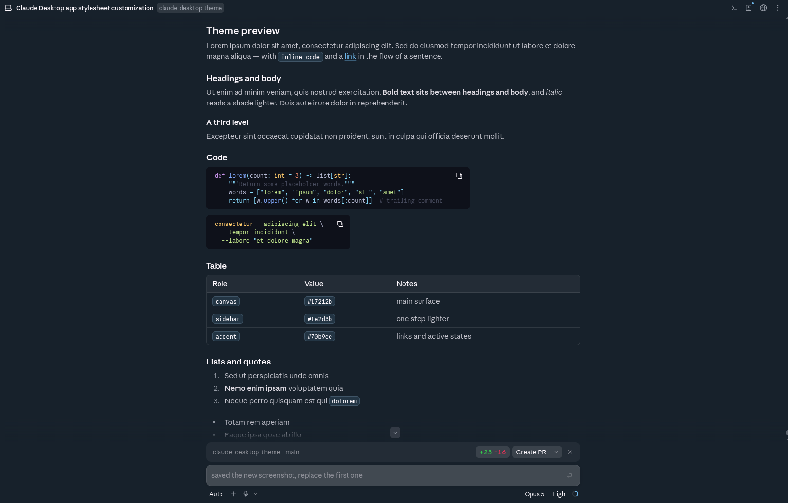
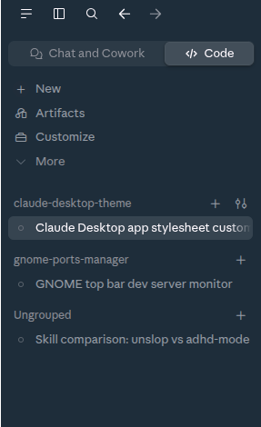

<div align="center">

# claude-desktop-theme

**Claude Desktop only offers light and dark. This gives it a real theme.**

A [Claude Code](https://claude.com/claude-code) skill — bring a palette, or point
it at a theme you already have, and it maps, applies, and reapplies after updates.

</div>



<div align="center">



<sub>Ocean theme from <a href="https://github.com/pingdotgg/t3code">t3code</a> — chat surfaces, code blocks, sidebar and activity dots</sub>

</div>

---

## Install

### With an agent

Hand this to Claude Code, or any coding agent with filesystem access — it will
clone the repo, install the skill and walk you through theming:

```
Install the Claude Desktop theming skill from
https://github.com/RemyMachado/claude-desktop-theme

Clone it into ~/.claude/skills/claude-desktop-theme (or .claude/skills/ in this
project), read its SKILL.md, then run it. It will ask what I want the app to
look like before changing anything.
```

### Manual install

Clone it into your Claude Code skills directory, available to every project:

```bash
git clone https://github.com/RemyMachado/claude-desktop-theme \
  ~/.claude/skills/claude-desktop-theme
```

Or scope it to a single project:

```bash
git clone https://github.com/RemyMachado/claude-desktop-theme \
  .claude/skills/claude-desktop-theme
```

Then invoke it by name — `/claude-desktop-theme` — or simply ask Claude Code to
theme your Claude Desktop.

Either way, the skill introduces itself, shows you what it is about to run, and
waits before anything touches your system.

**Requirements:** `python3`, `node` (optional — used for a syntax check), and
`pkexec` or `sudo`.

## How it works

The desktop app renders `claude.ai` remotely rather than a local bundle, so there
is no stylesheet to edit. The skill repacks the app's `app.asar` with a small
injection in the Electron main process, which applies three things on every page
load:

| Channel | Reaches |
|---|---|
| **Stylesheet** | surfaces, text, borders, code chips, activity dots |
| **`titleBarOverlay`** | the minimise / maximise / close buttons, drawn natively |
| **User script** | app preferences and anything CSS cannot express |

All three files are re-read on each load, so **only the first install needs a
repack and root**. Colour changes after that are an edit and a restart.

Around **131 customisation points** are covered, resolved through ~21 semantic
roles — so a new palette is a small file, not a long form.

## It is interactive

You say what you want it to look like. The skill maps it, then tells you which
roles your palette did not cover and asks whether to leave those alone or derive
them from the colours you did give.

It also asks once what size you want the chat text — Claude's own Large setting
is only about 15px — and remembers the answer.

It never silently invents values, and it never reduces what is customisable —
derivation fills gaps, it is not a cap.

## Themes

Palettes live in `themes/`; `generate.py --theme NAME` selects one.

```bash
python3 generate.py --theme ocean
```

`ocean` is included as a **worked example**. Its palette comes from
[t3code](https://github.com/pingdotgg/t3code)'s theme of the same name, credited
in the file — it
demonstrates the capture workflow, not a recommendation. Most people bring their
own.

[**docs/capturing-a-palette.md**](docs/capturing-a-palette.md) walks through
lifting an exact palette out of another installed app, which is how `ocean` was
made.

## Text size

The chat text size is set in pixels in a local `settings.json` (not tracked):

```json
{ "chat_text_size": 18 }
```

Run `python3 generate.py` and restart the app — no reinstall and no password,
since the stylesheet is read from disk on every launch. Remove the key to go
back to Claude's own sizes. SKILL.md's *Chat text size* section explains which
layers it has to override and why.

## Platform

Built and verified on **Linux** with the `.deb` build. Nothing assumes a path —
the installation is discovered via `CLAUDE_DESKTOP_ROOT`, the launcher on `PATH`,
then known locations.

[`platforms/`](platforms/) holds notes for other systems. Electron enforces ASAR
integrity validation on macOS and Windows but not Linux, so a repacked archive is
rejected there. That is two extra steps rather than a wall — recompute the header
hash (already implemented) and write it where the platform expects, plus an
ad-hoc re-sign on macOS.

Verified against Claude Desktop `1.40609.1`. It depends on undocumented internals
of a frequently-updated closed application, so expect occasional re-derivation;
the skill documents how.

## What it changes on your system

Everything is backed up and reversible, and nothing happens without you
confirming it first. In detail:

**The app archive.** Theming means replacing `app.asar`, which holds the
application's code. The original is copied to `app.asar.orig` before anything is
written, and `./revert.sh` puts it back. The build verifies the archive before it
is installed — every entry present, only the injected file changed, all hashes
matching — and refuses to hand over anything it cannot prove sound.

**Root access**, once, for that copy. The injected files themselves live in the
skill directory and are read at runtime, so later colour changes need nothing
privileged.

**Reading another app**, only if you ask for it. Capturing a palette from
something already installed means unpacking it, which can use a few hundred
megabytes temporarily. The skill names the app first and cleans up after.

One thing worth understanding rather than glossing: the user script is
JavaScript that runs inside your authenticated Claude session. That is what makes
non-CSS surfaces reachable at all. It ships inert — read `claude-theme.js` before
installing, as you would any userscript.

## Contributing

Issues and PRs welcome, particularly:

- **Other platforms** — add a file to `platforms/`. macOS and Windows need the
  integrity-hash step described there; other Linux distros are mostly path
  discovery.
- **More example themes** — Nord, Catppuccin, Gruvbox and friends map cleanly
  onto the role list.
- **Light mode** — every value is generated for both modes, but this was built
  and judged entirely in dark. The light palette is untested.

### Good first issues

- **More font sizes.** The chat text size is covered; the sidebar, the
  composer and code blocks still use the app's own sizes. The same
  knob-and-derive pattern in `binding.json`'s `chat_text_size` would extend to
  them.
- **Derive the baked values.** Ten hard-coded hex values in `binding.json` (the
  retinted greys, the text ladder, the code chip) survive a palette swap
  silently. They should be expressions over palette roles.
- **Preview before install.** Render a swatch sheet so a theme can be judged
  without a restart.
- **State the role contract.** Only 21 of the example palette's 57 roles are
  referenced; the contract could be explicit rather than inherited.

### Working on it

Clone anywhere and symlink, so the checkout *is* the live skill:

```bash
git clone https://github.com/RemyMachado/claude-desktop-theme
ln -s "$PWD/claude-desktop-theme" ~/.claude/skills/claude-desktop-theme
```

`claude-theme.css`, `titlebar.json` and `app.patched.asar` are build outputs and
gitignored — regenerate with `python3 generate.py`.

## Licence

MIT. The `ocean` palette is credited to its authors and included as an example.
